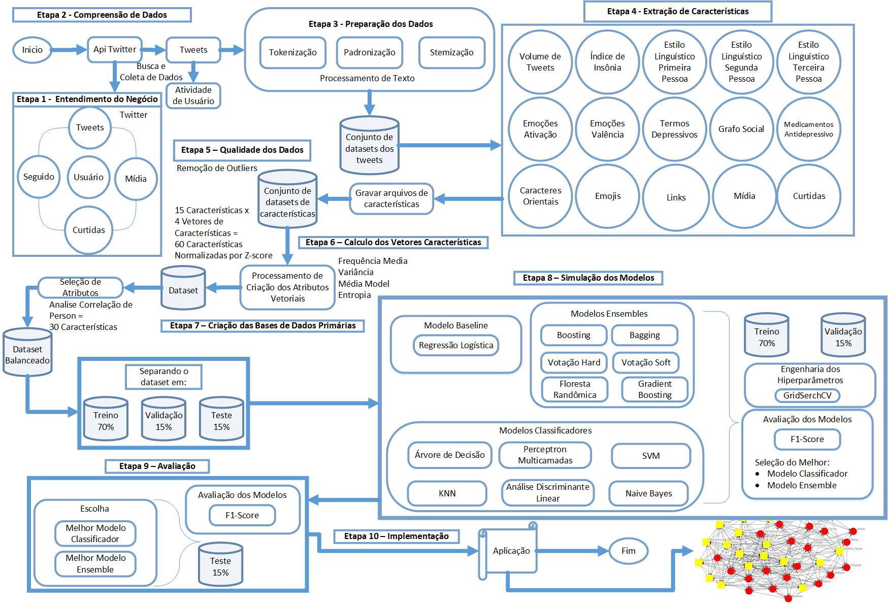

# UnBSense (Em Construção)

## Table of Contents
   1. [Introdução](#Introdução)
   2. [Objetivos](#Objetivos)
   3. [Metodologia](#Metodologia)


## Introdução

O projeto tem com proposito aplicar métodos de mineração de dados para coletar tweets em português de usuários no Twitter com seus conteúdos e atividades, pré-processá-los e extrair atributos para gerar 2 bases dados de 2 períodos (de forma anônima):
 - Pré-Pandemia (01/01/2018 a 31/12/2019);
 - Pandemia (01/01/2020 a 31/12/2021). 

Essas bases são compostas de 15 atributos:
- 10 atributos da pesquisadora De Choudhury (literatura); e 
- 5 novos atributos. 

## Objetivos

Usar as bases para elaborar modelos promissores capazes de detectar sinais de padrões de comportamentos depressivos ou não depressivos nos tweets.

Analisar se novos atributos induzidos nos modelos tem desempenho promissor em relação aos atributos da De Choudhury.

Analisar se houve aumento ou diminuição dos casos de depressão no Twitter entre a pré-pandemia e a pandemia COVID-19.

Disponibilizar as bases de dados.

## Metodologia



### Atributos

As bases são de composto de 15 atributos (1 a 10 da De Choudhury e 11 a 15 novos atributos) que descrevem o comportamento e atividade num usuário no Twitter:


1. Volume de Tweets. Quantidade de tweets postados;
    
1. Índice de Insônia. Relação de quantidade tweets postados no período da noite (21:00-6:00) pela quantidade tweets postados no período do dia (6:01- 20:59);
    
1. Estilo Linguístico na 1ª pessoa. Quantidade de palavras na 1ª pessoa do caso reto no singular e plural;
    
1. Estilo Linguístico na 2ª pessoa - Quantidade de palavras na 2ª pessoa do caso reto no singular;
    
1. Estilo Linguístico na 3ª pessoa - Quantidade de palavras na 3ª pessoa do caso reto do singular e plural [1];
    
1. Valência de Emoções. Cálculo da média de variância (estado emocional), usando-se a base de dados ANEW-BR \cite{kristensen_normas_2011};
    
1. Ativação de Emoções. Cálculo da média de ativação (reação emocional), usando-se a base de dados ANEW-BR \cite{kristensen_normas_2011;
    
1. Termos Depressivos. Cálculo da Media das palavras com valência menor que 4 (palavras negativas) usando a base de dados ANEW-BR \cite{kristensen_normas_2011;
    
1. Grafo Social. Quantidade de respostas de seguidores respondendo a um tweet;
    
1. Medicamentos Antidepressivos. Usando-se uma base de dados de medicamentos antidepressivos, calcula-se a frequência dos termos de medicamentos;
    
1. Caracteres Orientais. Quantidade de caracteres no intervalo unicode japonês, chinês e coreano. 

1. Emojis. Quantidade de emojis no intervalo unicode de emojis;
    
1. Frequência de Links. Quantidade de links nos tweets;
    
1. Mídia. Quantidade de fotos, vídeos e gifs nos tweets;
    
1. Número de Curtidas. Quantidade de curtidas nos tweets.

## Sumarização dos vetores de características 

Cada um dos 15 atributos foi sumarização em 4 vetores características com objetivo de sintetizar as séries temporais em único registro, totalizando 60 atributos nas bases de dados. Os vetores são:

- Frequência Média: A média da série temporal de um atributo durante todo o período de análise
- Variância: A média da frequência média do quadrado do desvio médio da série temporal de um atributo ao longo de todo o período.
- Média Móvel Ponderada: Tendência relativa de série temporal, em comparação com um período fixo anterior.  Dada a série temporal acima, e um período de duração de M (= 7) dias.
- Entropia: A medida de incerteza em uma série temporal.


## Requirements

- tweepy==3.10.0
- snscrape
- pandas
- numpy
- tqdm
- unidecode
- nltk
- spacy
- matplotlib
- sklearn
- xlrd
- openpyxl
- seaborn
- matplotlib_venn
- wordcloud
- jupyter

## Installing

**Git:**
```bash
git clone https://github.com/luanfreitas5/UnBSense.git
cd twint
pip install -r requirements.txt
```

## Etapas para executar 

1. Buscar Usuarios (depressivos e não depressivos) no Twitter - Multi-Threads
    ```bash    
    python main.py -m buscar
    ```

2. Coletar tweets de Usuarios (depressivos e não depressivos) no Twitter - Multi-Threads  (processo demorado)
    ```bash    
    python main.py -m coletar
    ```
    
3. Mesclar datasets de tweets - Uma Thread
    ```bash    
    python main.py -m mesclar
    ```
    
4. Preparação de Textos nos tweets - Uma Thread
    ```bash    
    python main.py -m limpar
    ```
    
5. Extração de caracteristicas (atributos) - Uma Thread
    ```bash    
    python main.py -m atributos
    ```
    
6. Limpeza de Outliens - Uma Thread
    ```bash    
    python main.py -m qualidade
    ```
    
7. Calculo do vetores de caracteristicas - Uma Thread
    ```bash    
    python main.py -m vetores
    ```
    
8. Criar bases de dados
    ```bash    
    python main.py -m dataset
    ```
    
9. Plotar graicos de exploração de dados - Uma Thread
    ```bash    
    python main.py -m exploracao
    ```
    
9. Plotar graficos de exploração de dados - Uma Thread
    ```bash    
    python main.py -m exploracao
    ```
    
10. Criar base de textos para nuvem de palavras - Multi-Thread (processo demorado)
    ```bash    
    python main.py -m basetexto
    ```
    
11. Obter frequencia de palavras para nuvem de palavras - Multi-Thread
    ```bash    
    python main.py -m basetexto
    ```
    
12. Plotar nuvem de palavras - Uma Thread
    ```bash    
    python main.py -m nuvempalavras
    ```


## Referências

1. <a href="#" id="ref-1"></a> Márcia Lima, Victor Valle, Estevão Costa, Fylype Lira, and Bruno Gadelha, "Software Engineering Repositories: Expanding the PROMISE Database", Proceedings of the XXXIII Brazilian Symposium on Software Engineering (SBES 2019), Association for Computing Machinery, 427–436. DOI: 10.1145/3350768.3350776